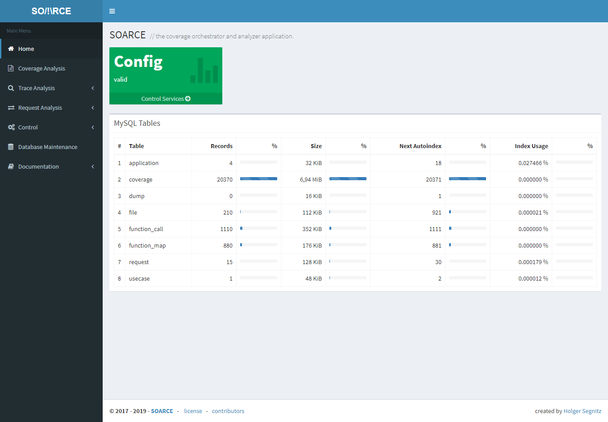
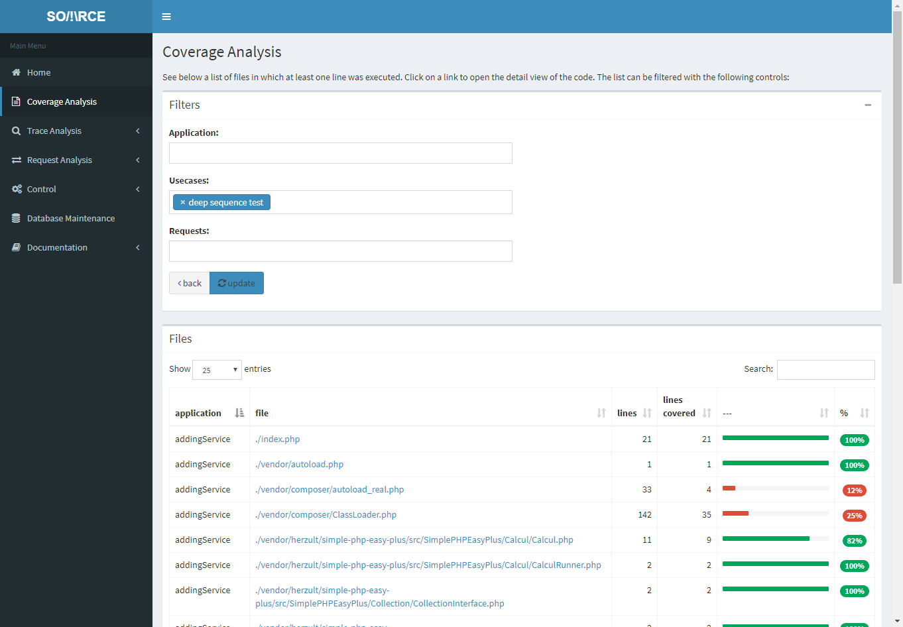
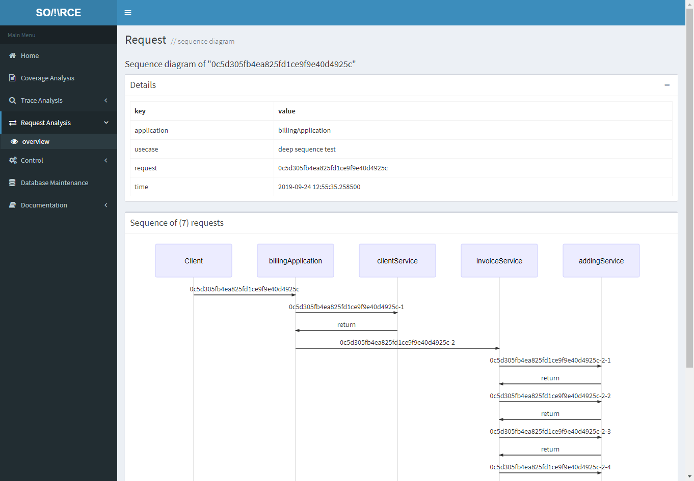
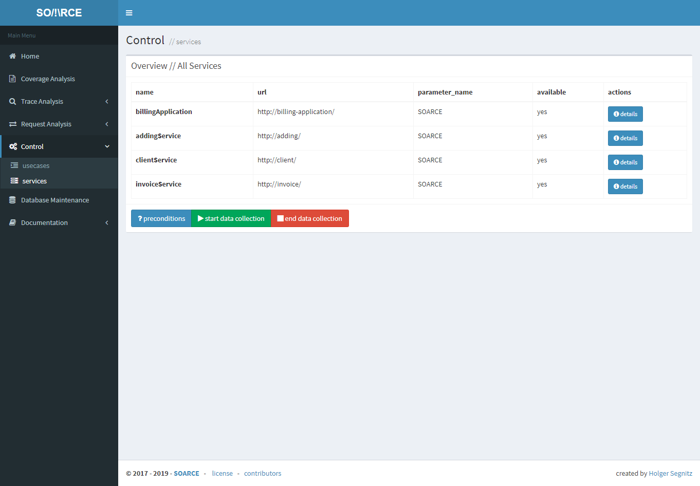

# Welcome to SOARCE

## Introduction

SOARCE is a duo of a web application and a composer package that aims to bring
clarity into the fog of legacy PHP applications that have any combination of the following flaws:
* undocumented source - or worse, outdated documentation
* close to no unit tests or integration tests
* heavy use of global and/or public static variables, magic methods, hooks, dynamic variables
* ... and since we liked the challenge, applications that are split into (micro)services.

Facing these issues, you are often left with the task of mapping out the landscape yourself, debug
with die() or log statements. Maybe you have an End2End test suite at hand, but that doesn't help
much on its own.

This is where SOARCE can be of help. It doesn't just show the end result of the coverage, it allows you to explore
and drill down. To search inside. It also answers the question "I've changed this function, what tests do I need
to re-run?"

With SOARCE, for most cases, all you need to do is install one dev-requirement into each of your
services or applications, make sure xdebug is available in their docker containers and then
fire up and config the main SOARCE application. Our goal was to make this as minimal invasive
as possible.

After doing so, you will be able to run any integration or end-to-end test suite and have SOARCE
automatically gather and analyse a lot of helpful information in real time in the background: 
Code coverage, function call traces, request parameters and service call sequences.

The SOARCE web application provides a set of helpful views on the collected data with a set of
filters to make searching easy and also reduce noise:

* **Code Coverage** will be stored with a granularity of "request within a use case". This means
that you can look at the coverage of an individual request (or any number), of a usecase (or many)
or the whole test suite.
* The same is valid for **function calls**. You can look at all of them or filter them down. For
functions you will also be able to see callers and callees for each function and the frequency.
* SOARCE is also able to not only track **HTTP requests** but draw a **sequence diagram** for all
subsequent calls within the topmost/main one.
* The coverage can also be exported so you can combine it with the results of a phpunit run to create a
  combined coverage report.

## Screenshots

[more screenshots...](screenshots.html)

## Requirements

### Application / Server
* Docker
* Docker-Compose
* Composer

### Plugin / Client
* PHP >= 7.3
* xdebug 3.1
* a linux vm or docker container for your application(s)/service(s)
* composer autoloader if you want everything to work automatically
